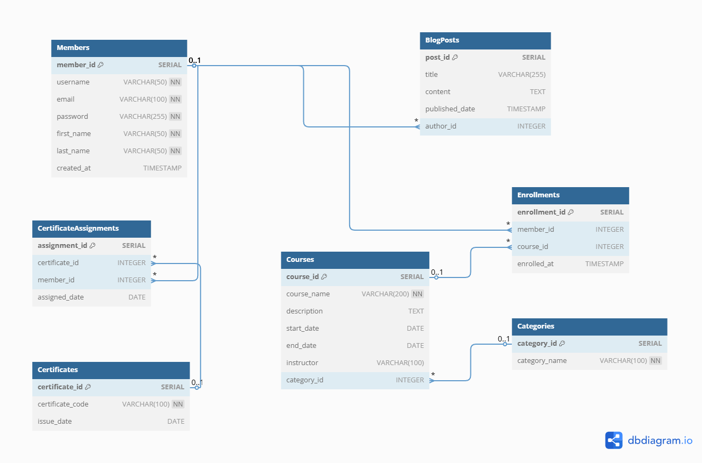

# SQL Bootcamp Projects

This repository contains the SQL assignments and final project I completed as part of the **TurkStudentCo Data Science Bootcamp**. During the bootcamp, I learned how to work with relational databases using **PostgreSQL**, write SQL queries, and design efficient database schemas.

In addition to the assignments provided during the program, I have also included extra practice exercises and projects that I developed independently to reinforce my learning.

## Final Project Overview

In the final project, I designed a relational database schema for an online learning platform. The system supports users who can register, enroll in courses, earn certificates, and publish blog posts.

The project includes:
- 7 interrelated tables covering members, courses, categories, enrollments, certificates, certificate assignments, and blog posts
- Proper use of primary keys, foreign keys, and unique constraints to ensure data integrity
- Database implemented using PostgreSQL and tested with pgAdmin 4
- A visual entity-relationship (ER) diagram to demonstrate the schema

## Database Schema Diagram

The following image shows the structure of the final project database, including all tables and relationships:

## Technologies Used

- PostgreSQL
- pgAdmin 4
- SQL
- ER Diagram Tools (dbdiagram.io, draw.io)

## About This Repository

This repository was created to document my learning journey in SQL and relational database design. It serves as both a reference for future projects and a portfolio of my progress during the bootcamp. I plan to continue expanding this repository with more practice and projects over time.
